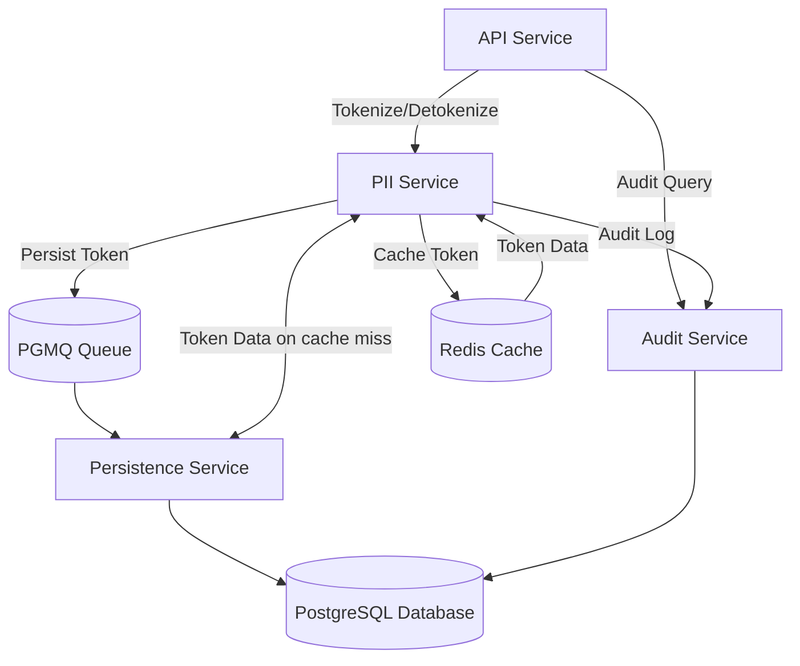

# Mistokenly

Mistokenly is a secure, scalable platform for tokenizing, storing, and managing sensitive Personally Identifiable Information (PII) in modern applications. It is designed for privacy-first organizations needing robust data protection, compliance, and flexible integration.

The architecture is built with Kubernetes in mind as a microservices application to allow scaling and isolation at the network and cryptographic levels. Components are stateless, and replicas can be scaled up or out to handle load. The same images and configurations can be used to host the services in similar containerised environments. If using Kubernetes, it is recommended to implement service meshes in the cluster in order to round-robin connections and add additional protection to traffic between services.

## Getting Started

To quickly deploy Mistokenly on Kubernetes using Helm:

```bash
helm repo add mistokenly https://example.com/helm-charts
helm install mistokenly mistokenly/mistokenly --namespace mistokenly --create-namespace
```

Replace `https://example.com/helm-charts` with the actual Helm chart repository URL.

## Overview

Mistokenly provides:
- Zero-knowledge tokenization of PII (email, phone, etc.)
- Multi-tenant architecture with strong encryption
- Asynchronous persistence and audit logging
- Easy integration via REST and gRPC APIs
- Docker/Kubernetes-ready deployment

## Our Driving Principles
- Reduce the need for organisations to store PII
- The system should operate with a defense-in-depth strategy
- In the event of a breach, the system should never be able to decrypt PII on its own
- The system should be fast and highly performant, to ensure implementation isn't felt by the consumer
- The system should be easy to use

## Service Breakdown



### API Gateway
Exposes REST and gRPC endpoints for tokenization, detokenization, and audit queries. Handles authentication, rate limiting, and service discovery.

### PII Service
Core service for encrypting, tokenizing, and retrieving PII. Implements key management and caching for high performance.

### Persistence Service
Asynchronous worker that persists tokens and audit logs to PostgreSQL, using PGMQ for message queuing.

### Audit Service: 
Tracks access and changes to PII for compliance and monitoring.

## Why use this?

- **Security**: AES-256-GCM encryption, key hierarchy (KEK/TEK/FDK), HKDF-based key derivation, and zero-knowledge design
- **Compliance**: Building towards support for GDPR, HIPAA, PCI DSS, and other privacy regulations
- **Scalability**: Designed for high throughput and low latency (10,000+ req/s)
- **Flexibility**: Deployable on-premises, cloud, or hybrid; supports Docker, Kubernetes, and Helm
- **Developer Experience**: Simple APIs, clear documentation, and ready-to-use configuration

## Key Separation and Encryption/Decryption Flows

Mistokenly uses multiple layers of encryption keys to keep data secure:

- **Key Encryption Key (KEK):** The master key, used to encrypt Tenant Encryption Keys.
- **Tenant Encryption Key (TEK):** Unique for each tenant, encrypted by the KEK.
- **Organisation Key (ORK):** Provided by the user, combined with the TEK to create Field Data Keys.
- **Field Data Key (FDK):** Unique for each data field, derived from the TEK and organisation key, used to encrypt/decrypt PII.

**Encryption:**
- PII is sent to the service with an ORK
- The ORK is verified, and then decrypted with the KEK
- The TEK is decrypted with the KEK
- The decrypted TEK and ORK are used to derive a Field Data Key (FDK) using HKDF-based key derivation
- The PII is encrypted, stored and a reference hash is created.
- The reference hash is returned.

**Decryption:**
- A reference hash and ORK are sent to the service
- The reference hash is verified in conjunction with the ORK.
- The ORK and TEK are decrypted with the KEK.
- The decrypted TEK and ORK are used to derive a Field Data Key (FDK) using HKDF-based key derivation
- The reference hash is used to find a PII entry in the cache or database
- The PII is decrypted using the FDK and returned.

The ORK always remains with the requesting party and is not stored within the system. This, coupled with using HKDF to derive FDKs ensures each key is unique and isolated, supporting strong security and compliance. 

## Use Cases

- Tokenize customer emails, phone numbers, or other PII for privacy and compliance
- Securely store and retrieve sensitive data in SaaS, healthcare, fintech, or enterprise apps
- Enable audit trails for data access and changes
- Integrate with existing authentication and authorization systems
- Support multi-tenant SaaS platforms with isolated encryption keys

## Recommendations for implementation

### Network Isolation
Deploy services in private subnets or isolated VPCs. Restrict inbound and outbound traffic using firewalls, security groups and Kubernetes network controls. Limit access to sensitive services (e.g., database, cache) to only the components that need it - refer to the diagram above.

### TLS Traffic
Enforce TLS for all service communication. Use strong cipher suites and regularly rotate certificates. Validate certificates for all connections to prevent man-in-the-middle attacks.

### Implement a service mesh
A service mesh (such as Istio or Linkerd) provides advanced traffic management, including automatic round-robin load balancing between service replicas. This ensures even distribution of requests, improves fault tolerance, and simplifies observability and security policies. Integrating a service mesh enables seamless scaling and consistent connectivity across microservices, while enforcing mutual TLS and fine-grained access controls.

### Use Managed Database and Cache Services
Leverage managed offerings (e.g., AWS RDS, Azure Postgres, AWS ElastiCache for Redis, Azure Redis) for automated patching, backups, and monitoring of the database and redis related components. Enable encryption at rest and in transit for all data stores.

### Secrets Management
Store encryption keys, API secrets, and credentials in a dedicated secrets manager (e.g., AWS Secrets Manager, HashiCorp Vault). Don't hard-code secrets in source code or configuration files.

### Role-Based Access Control (RBAC)
Implement RBAC for all services and infrastructure with access to this service. Grant least privilege access to users and service accounts. Regularly audit permissions and remove unused accounts.

### Logging and Monitoring
Enable centralized logging and monitoring for all services. Use tools to detect anomalies, unauthorized access, and potential breaches. Ensure logs are immutable and protected from tampering.

## Development

### Generating Protocol Buffers
All gRPC service definitions are located in `server/proto/<service>/` directories. To regenerate the Go protobuf files after making changes:

```bash
cd server
buf generate
```

This will regenerate all `.pb.go` and `_grpc.pb.go` files in their respective service directories.

### Project Structure
```
server/
├── proto/                    # Protocol buffer definitions
│   ├── audit/               # Audit service protos
│   ├── pii/                 # PII service protos
│   └── persistence/         # Persistence service protos
├── cmd/                     # Service entry points
├── internal/                # Internal packages
│   ├── api/                # REST API handlers
│   ├── common/             # Shared utilities
│   └── services/           # gRPC service implementations
└── migrations/             # Database migrations
```

## Coming Soon
- **Client SDKs**: Allow easy usage for the service
- **Format Preserving Encryption (FPE)**: Maintain data format for downstream compatibility
- **Homomorphic Encryption**: Enable computation on encrypted data
- **ML-based Anomaly Detection**: Advanced threat detection for unusual access patterns
- **Multi-region Active-Active**: Global deployment with conflict resolution

### Performance Targets
- **Current**: < 100ms tokenization, < 100ms de-tokenization
- **Target**: < 50ms tokenization, < 50ms de-tokenization

## Dependencies
Mistokenly leverages several open source projects for its core functionality and infrastructure:

- [PostgreSQL](https://www.postgresql.org/) – Relational database for persistent storage
- [PGMQ](https://github.com/tembo-io/pgmq) – Message queue built on PostgreSQL
- [Mermaid](https://mermaid-js.github.io/) – Diagram rendering in documentation
- [HKDF](https://github.com/coruus/hkdf) – Key derivation for cryptographic operations
- [Docker](https://www.docker.com/) – Containerization for deployment
- [Kubernetes](https://kubernetes.io/) – Orchestration and scaling of microservices
- [Helm](https://helm.sh/) – Kubernetes package management
- [Valkey](https://valkey.io/) – High-performance, open-source in-memory data store, compatible with Redis

These projects provide the foundation for Mistokenly's scalability, security, and integration capabilities.

---

See `CONTRIBUTING.md` for development guidelines and `SECURITY.md` for security best practices.